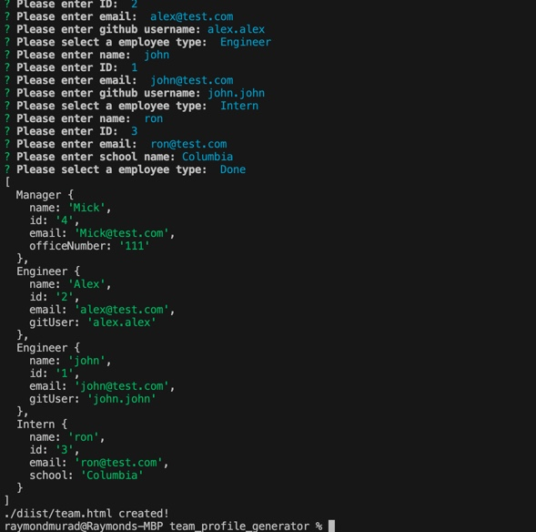
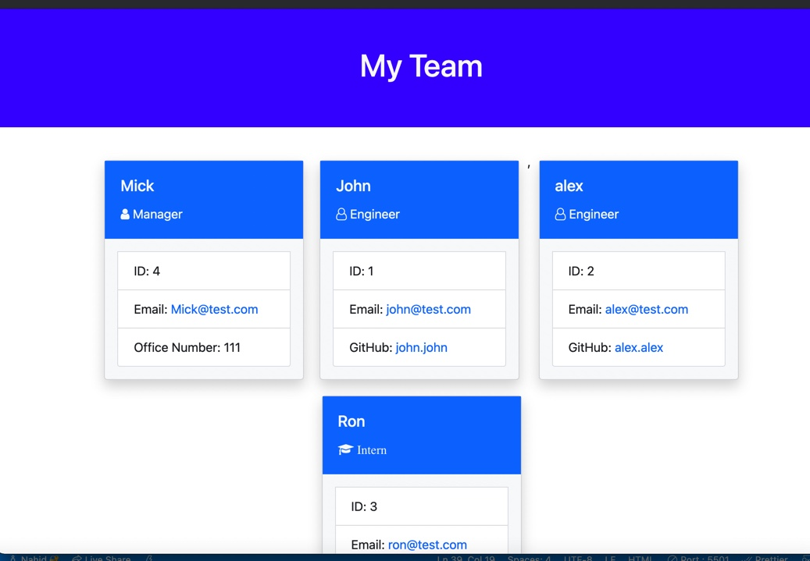

# team_profile_generator

- Command line interface application to generate a team profile in HTML.
## Installation
- Code:`git@github.com:Nahid1010/team_profile_generator.git`
- You can clone code from github link and run it locally on your computer.

## Installing and running

* Open a terminal.
* Create a directory for this project.
* Change current directory to this project direcory.
* Issue the following command -` git@github.com:Nahid1010/team_profile_generator.git `

* If you don't have `node.js` installed already then download it from here (`https://nodejs.org/en/download/`), and follow the instructions to install it.
* Once installed, use npm to install `inquirer` package by issuing `npm i inquirer` command at the terminal prompt.
* Also you need `jest` module to perform tests on your Classes properties and methods. You can install jest by following similar instructions for `inquirer `in above step.
* You can run this program by issuing `npm start` or `node index.js` command. Below is a snapshot of how I ran to produce a new readme file. An HTML file team.html will be created in the dist directory.
 ###### shows the output
 
 ###### Generated team.html 
 

 ###### Contacts
 - github: Nahid1010
 - Email: Nahidmahmud14@yahoo.com